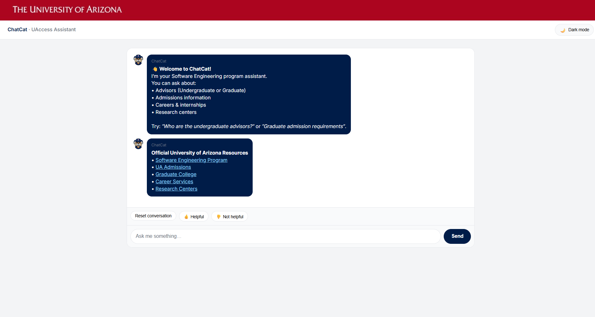

# 📘 ChatCat – UAccess Assistant  
---

My personal contributions

Backend development — Implemented Flask routing, session state logic, and domain‑specific flows (Admissions, Advising, PhD menu).

Knowledge base integration — Designed and coded the 47‑line knowledge module and fallback logic.

Error handling — Built the invalid‑input redirect system to keep conversations from breaking.

UI and template fixes — Ensured conversation history rendered correctly and debugged template issues.

Flow debugging — Tracked down issues with session variables, flow resets, and inconsistent responses.

Agile participation — Completed sprint tasks, contributed to retrospectives, and helped refine team workflow.

Teammates
* Stephen Nderitu 
* Enrique Zarate
* Koby Butler

## 📌 Description

ChatCat is an intelligent academic assistant built to support Software Engineering students at the University of Arizona.  
It connects students with official university information by answering questions about:

- Undergraduate & Graduate Advisors  
- MS / PhD Admissions Requirements  
- Careers & Internships  
- Research Centers  
- Official Program Resources  

The application includes:

- A rule-based admissions engine for BS, MS, and PhD questions  
- An AI-backed retrieval system for complex, open-ended queries  
- A modern Flask-powered chat interface  
- A UAccess-inspired UI design  

---

## 🖼️ Application Preview



## 🔧 File Descriptions

### Backend / Logic

| File | Description |
|------|-------------|
| `app.py` | Main Flask application (routes, session handling, chat orchestration). |
| `assistant.py` | Rule-based AdmissionsAssistant for BS/MS/PhD programs. |
| `assistant_ai.py` | AI semantic search (FAISS) and LLM fallback. |
| `memory.py` | Short-term conversation memory manager. |
| `messages.py` | Static HTML/text for welcome messages + advisor info. |
| `main.py` | Optional standalone local-run script. |

### Configuration

| File | Purpose |
|------|---------|
| `requirements.txt` | Python dependencies. |
| `.gitignore` | Ignores venv, cache files, and environment files. |

### Frontend

| Folder | Contents |
|--------|----------|
| `templates/index.html` | Main chat UI template. |
| `static/css/styles.css` | UI styling. |
| `static/img/` | Banner + application screenshots. |

---

# 🚀 Getting Started

## 1. Clone the Repository

```bash
git clone https://github.com/ezarate88/CatChat-Assistant.git
cd CatChat-Assistant
```

---

## 2. Create and Activate a Virtual Environment

```bash
python -m venv venv
```

### Windows

```bash
venv\Scripts\activate
```

### Mac/Linux

```bash
source venv/bin/activate
```

---

## 3. Install Dependencies

```bash
pip install -r requirements.txt
```

---

## 4. Run the Application

### Using Flask CLI:

```bash
export FLASK_APP=app.py
export FLASK_ENV=development
flask run
```

### Or run directly:

```bash
python app.py
```

Open your browser:

```
http://127.0.0.1:5000/
```

---

# 🧪 Testing the Application

Try:

- “Hello”
- “Admissions”
- “Masters”
- “PhD requirements”
- “Show PhD menu”

Confirm:

- MS flow works  
- PhD flow works  
- AI fallback works for general questions  

---

# 🧰 Technologies Used

- Python 3.10+  
- Flask  
- Flask-Session  
- sentence-transformers  
- scikit-learn  
- FAISS CPU  
- joblib  
- numpy  
- MarkupSafe  
- HTML/CSS (Frontend UI)

---

